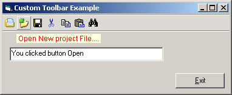



## DM Custom Toolbar

### Description

Hi, Was sitting at my system thinking what to do. well I make a custom toolbar without using picture arrays just by using a one strip of bitmaps 16x16 and BitBlt and TransparentBlt and the Line function to make a kind of toolbar. anyway the toolbar you can add your own button click code and button up code it also has a tooltip.

I know this ant as good as the normal toolbar but it quick simple and easy. anyway I hope you beginners may find some ideas from this code to help you. Please vote if you like this code.
 
### More Info
 

             |
---                |---
**Submitted On**   |2001-08-29 17:33:16
**By**             |[dreamvb](https://github.com/Planet-Source-Code/PSCIndex/blob/master/ByAuthor/dreamvb.md)
**Level**          |Beginner
**User Rating**    |4.8 (24 globes from 5 users)
**Compatibility**  |VB 6\.0
**Category**       |[Graphics](https://github.com/Planet-Source-Code/PSCIndex/blob/master/ByCategory/graphics__1-46.md)
**World**          |[Visual Basic](https://github.com/Planet-Source-Code/PSCIndex/blob/master/ByWorld/visual-basic.md)
**Archive File**   |[DM\_Custom\_1775667302004\.zip](https://github.com/Planet-Source-Code/dreamvb-dm-custom-toolbar__1-55245/archive/master.zip)

